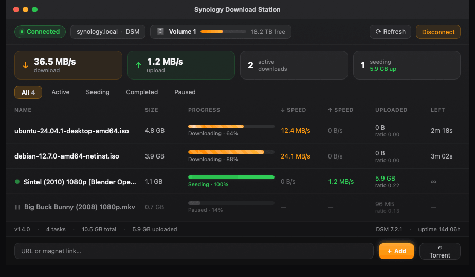
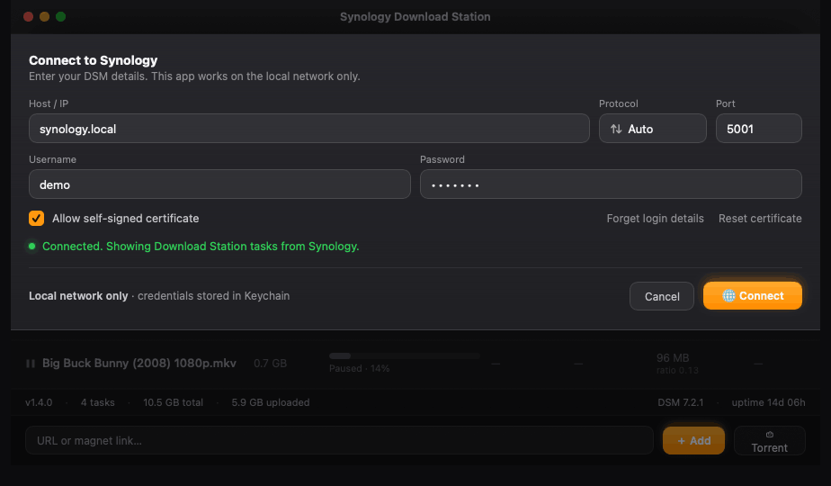
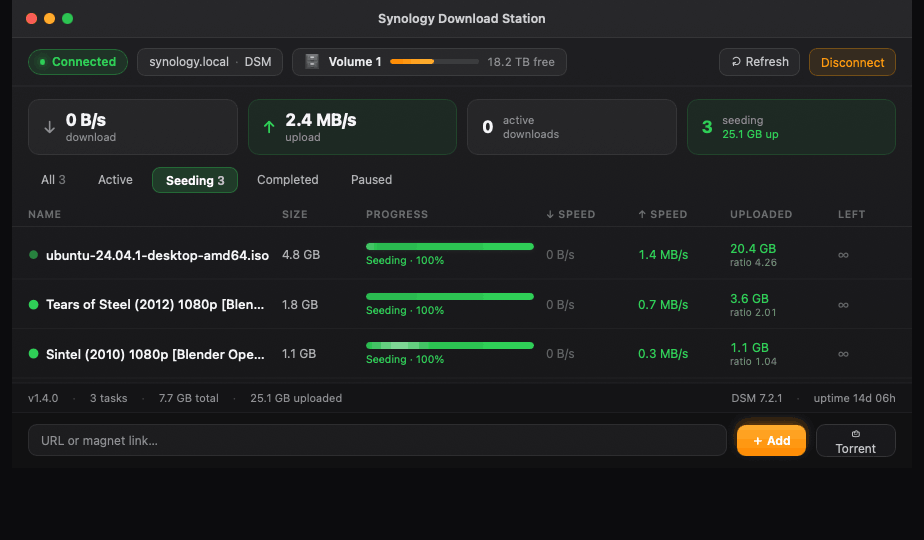

# Synology Download Station Monitor

[](https://github.com/abgitdev/SynologyDownloadStationMonitor/actions/workflows/build.yml)


A fast, **native macOS** app (SwiftUI) for monitoring and managing **Synology Download Station** on your local network. It connects to your Synology NAS over the official DSM / Download Station Web API and shows your tasks, progress, status, download/upload speeds, total uploaded, DSM version, uptime, volume usage, and estimated time remaining — in a clean dark interface.

> The Mac never downloads anything itself. Your **NAS** does the downloading via Download Station; this app is a native remote control that displays state and sends commands.



---

## Table of contents

- [Features](#features)
- [Screenshots](#screenshots)
- [Requirements](#requirements)
- [Install — build from source](#install--build-from-source)
- [Connecting](#connecting)
- [Two-step verification (2FA)](#two-step-verification-2fa)
- [Adding torrents and links](#adding-torrents-and-links)
- [Managing tasks](#managing-tasks)
- [Download folder](#download-folder)
- [Security & privacy](#security--privacy)
- [Uninstalling](#uninstalling)
- [Data storage](#data-storage)
- [Troubleshooting](#troubleshooting)
- [License](#license)

---

## Features

- **Live task dashboard** — list of all Download Station tasks with progress, size, ↓/↑ speed, uploaded amount, ratio, and time left. Auto-refreshes about every 5 seconds (paused while the window is hidden to save resources).
- **Summary cards** — total download/upload speed, number of active and seeding tasks at a glance.
- **Filter tabs** — All / Active / Seeding / Completed / Paused.
- **Add torrents as files** — pick a `.torrent` and the app uploads the real file to the NAS (the same path the DSM web UI uses), so the task starts with the correct name and metadata. Falls back to a magnet link only if the file upload isn't possible.
- **Add URLs & magnet links** — paste a link and hit Add. Supports `magnet:`, `http(s):`, `ftp(s):`, and `ed2k:`.
- **Task management** — pause, resume, and remove tasks (single or multiple selection); right-click a row for per-task actions including *Show in Finder*, *Copy magnet / link*, and *Open in DSM web*.
- **Two-step verification (2FA)** — full support for DSM accounts with 2FA, including "remember this device" so the code is asked only once. See [below](#two-step-verification-2fa).
- **NAS health at a glance** — DSM version, system uptime, and volume free space.
- **Security first** — LAN-only, HTTPS by default, TLS certificate pinning (TOFU), password stored only in the macOS Keychain. See [Security & privacy](#security--privacy).
- **Clean uninstall** — a built-in *Delete app* button erases all of the app's data (Keychain entries, preferences, caches) and moves the app to the Trash.

---

## Screenshots

**Connecting to your NAS**



**Seeding view**



---

## Requirements

- **macOS 14 (Sonoma) or newer.**
- A **Synology NAS with DSM** on your local network.
- The **Download Station** package installed and enabled in DSM.
- The NAS reachable on your LAN via a **private address** (e.g. `192.168.x.x`, `10.x.x.x`) or a local name (e.g. `synology.local`).
- Access to the DSM ports (defaults: HTTPS `5001` / HTTP `5000`; the port is configurable).

This app is **local-network only by design.** QuickConnect, DDNS, port forwarding, and reaching DSM over the internet are neither used nor allowed — the app refuses to connect to a public address.

---

## Install — build from source

The app is distributed as **source only** (no pre-built binary). Building it yourself takes a few seconds and produces an app that opens with no Gatekeeper warnings, because it's signed locally on your own Mac.

```bash
git clone https://github.com/abgitdev/SynologyDownloadStationMonitor.git
cd SynologyDownloadStationMonitor
./build.sh release
open build/SynologyDownloadStationMonitor.app
```

You need **Xcode** (or the Swift toolchain / Command Line Tools) on macOS 14+. `build.sh` compiles the single Swift source file into a `.app` bundle in `build/` and also drops a copy on your Desktop.

> If you ever copy the built `.app` to a *different* Mac, that Mac's Gatekeeper may warn about an unidentified developer (the build is ad-hoc signed, not notarized). Right-click the app → **Open** once to allow it, or build it from source on that Mac.

---

## Connecting

On first launch the connection panel opens automatically (you can also open it by clicking the status chip). Enter your DSM **Host / IP**, **Port**, **Username**, and **Password**, then click **Connect** (or press Enter).

**Protocol modes:**

| Mode | Behavior |
| --- | --- |
| `Auto (HTTPS)` *(default)* | HTTPS only. The app **never falls back** to unencrypted HTTP, so the password can't be coaxed out over cleartext by a LAN attacker. |
| `HTTPS` | HTTPS only. |
| `HTTP` | Unencrypted HTTP on the LAN. Use only if your NAS has no HTTPS — the app warns that the password is sent in clear text. |

**Self-signed certificates.** If your NAS uses a self-signed HTTPS certificate (common for home setups), enable **Allow self-signed certificate**.

**Certificate pinning (TOFU).** On the first connection to a host the app records the fingerprint of the NAS's TLS public key and shows it to you for confirmation **before** sending the password. On later connections the certificate must match, otherwise the connection is rejected — this protects against a NAS being spoofed on your local network. If you legitimately changed the certificate on the NAS, click **Reset certificate**.

---

## Two-step verification (2FA)

Fully supported. If your DSM account has two-step verification (2FA/MFA) enabled:

1. Connect as usual with your username and password.
2. The app shows a **Two-step verification** prompt; enter the 6-digit code from your authenticator app.
3. After a successful login the app **remembers this Mac** (a device token issued by DSM), so the code is **not** requested on future connections.

The device token is a 2FA-bypass secret, so it's stored in the macOS **Keychain** (bound to this Mac, never synced to iCloud) and is removed by **Forget login details** and by uninstalling the app. Accounts **without** 2FA log in normally, with no extra step.

---

## Adding torrents and links

**`.torrent` files** — click **Torrent** and pick a file. The app uploads the actual `.torrent` to the NAS (`FileStation.Upload`) and asks Download Station to parse and start it — the same flow as the DSM web UI — so the download starts with the correct name and metadata. If FileStation is unavailable or the upload fails, it falls back to building a magnet link from the file's info-hash (the NAS then fetches metadata from peers).

Hybrid BitTorrent v1+v2 `.torrent` files are accepted. Pure v2-only files aren't converted yet — for those, use a ready-made magnet link or add the file through DSM directly.

**URLs and magnet links** — paste a link in the bottom field and click **Add**. Supported schemes: `magnet:`, `http(s):`, `ftp(s):`, `ed2k:`.

---

## Managing tasks

After connecting you get a table of tasks with filter tabs, summary cards, and a status line (DSM version, uptime, volume usage).

- **Select** one task with a click; **Cmd-click** to toggle and **Shift-click** to select a range, then use the bulk action buttons (Resume / Pause / Remove) in the toolbar.
- **Right-click** a row for per-task actions:
  - **Show in Finder** — reveal the task's folder/file (if the NAS share is mounted on the Mac).
  - **Copy magnet / link** — copy the task's source link.
  - **Open in DSM web** — open Download Station in your browser.
  - **Pause / Resume** — toggle the task.
  - **Remove task** — delete after confirmation.
- **Refresh** forces an update; **Disconnect** ends the session and clears local state.

---

## Download folder

On connect, the app checks your Download Station account's default download folder and, if it isn't set, configures one. Without a default folder, tasks on a non-administrative account are created but **hang** in `waiting` and never start — this is documented Synology behavior, not a bug in the app.

---

## Security & privacy

- **LAN only.** The app connects only to private NAS addresses on your local network and refuses public addresses. Don't expose DSM to the internet for this app (no port forwarding, QuickConnect, DDNS, or public IPs).
- **HTTPS by default**, with TLS public-key pinning (TOFU) and no silent cleartext fallback.
- **Password** is stored only in the macOS **Keychain** (`ThisDeviceOnly`, never synced to iCloud). Host, username, and protocol/port settings are stored in `UserDefaults`.
- **Session SID** lives only in process memory — it's never written to disk and is cleared on logout, disconnect, or session invalidation.
- **No telemetry, no analytics, no network calls** other than to the NAS you connect to.

---

## Uninstalling

At the bottom of the connection panel there's **Delete app**: it erases all of the app's data (Keychain password / certificate pin / 2FA device token, UserDefaults, caches) and moves the `.app` to the Trash. The one thing it can't remove is the **Local Network** entry in macOS system settings — remove it manually in *System Settings → Privacy & Security → Local Network* if you wish.

---

## Data storage

| Data | Where | Notes |
| --- | --- | --- |
| Password | macOS Keychain | `ThisDeviceOnly`, not synced to iCloud |
| Certificate pin | macOS Keychain | TLS public-key hash for the host |
| 2FA device token | macOS Keychain | per host+account, removed on Forget / uninstall |
| Host, username, protocol, ports | `UserDefaults` | non-secret settings |
| Session SID | process memory only | never written to disk |

---

## Troubleshooting

**Wrong DSM username / password.** Double-check your DSM credentials. The password is stored in the Keychain and updated on a successful connection.

**Permission denied.** The DSM user must have access to Download Station.

**Task added but not downloading (stuck on "waiting").** Usually an empty default download folder on the account. The app sets it automatically on connect; if that doesn't help, set a default folder in DSM → Download Station → Settings → Location.

**Self-signed HTTPS certificate.** Enable **Allow self-signed certificate** in the connection panel.

**Certificate mismatch.** If you changed the TLS certificate on the NAS, click **Reset certificate** so the app re-learns the new one.

**Download Station not installed.** Install and enable the Download Station package in DSM's Package Center.

**macOS blocks the local network.** Grant the app Local Network access in *System Settings → Privacy & Security → Local Network*; without it the connection shows "offline".

---

## License

[MIT](LICENSE) © abgitdev
